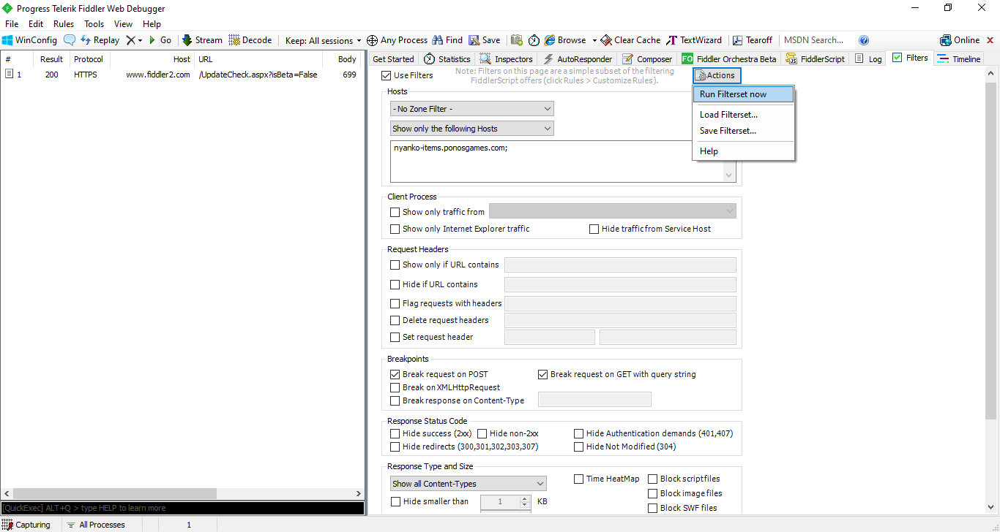
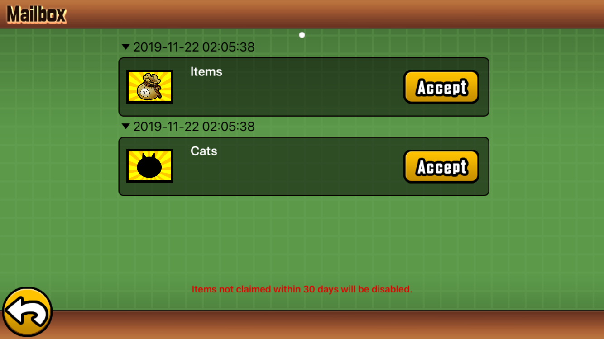
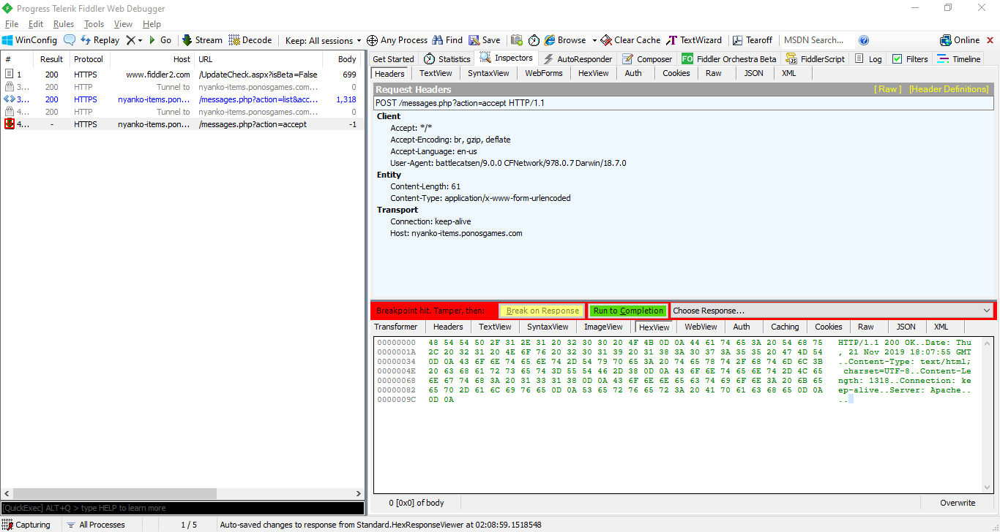

# Cat-In-The-Middle

**Battle Cats MITM Mailbox Hack**

_"Playing it like a fiddle."_

This mailbox hack allows players to acquire items and/or cats of their choice.

## NOTICE

This method **DOES NOT SEEM TO WORK ANY MORE** for versions v11.1.0 and above as mentioned [here](https://github.com/jamestiotio/CITM/issues/7) (at least not without root/jailbreak access), possibly due to either [Certificate Pinning](http://fiddler.wikidot.com/certpinning) or usage of nonces to prevent replay attacks. If Certificate Pinning was implemented, it might be possible to remove the pinned certificate or replace it with a self-signed certificate from Fiddler from the APK/IPA binary file of the application, but this requires root/jailbreak access (and it might be too difficult for the layperson to execute without some kind of automation script to help them do it). Unfortunately, I do not currently possess any rooted/jailbroken devices, and thus, I am unable to test this theory out. If someone else is able to conduct further investigations into this, feel free to report your findings and maybe put up an issue/PR about it.

That said, PONOS had never informed me formally/officially about this patch, even after I had responsibly disclosed this issue to them. They might have figured it out internally by themselves and decided to not inform me about it at all (or forgot to inform me).

The legacy descriptions below will be kept as is for archival and posterity reasons.

## Disclaimer

This repository was made only for research and educational purposes. I am not personally responsible in any way for any unethical malpractices because of this tool. If [PONOS](https://www.ponos.jp/) were to approach me to take down, archive or privatise this repository, I will be obliged to follow their will.

Please support the developers of Battle Cats so that they can add more content for the players of Battle Cats! ヾ(°∇°\*)

_UPDATE (9 Jan 2020): I kindly raised an issue regarding this MITM vulnerability to PONOS through an [in-game inquiry](https://ponos.s3.dualstack.ap-northeast-1.amazonaws.com/information/appli/battlecats/contact/en/contact.html) (for the purpose of responsible disclosure) with an added suggestion of encrypting the data being transmitted but they just simply banned my savegame file, so... ¯\_(ツ)\_/¯_

> I am currently contacting PONOS Games through [email](mailto:support_en@bc01.ponos.net) and through their [contact/inquiry page](https://www.ponos.jp/contact/inquiry/) to check with them and update them regarding this MitM vulnerability. I will post more updates if they get back to me with any kind of statements/news/notices/messages/reports/accounts.

## Features

1. This hack follows a Man-in-the-Middle (MITM) network approach instead of the usual save data modification (using transfer code and confirmation code). The latter would be more easily detected by the corresponding servers if playing online.

2. This method would not require any jailbreaking, rooting or any game cheating/hacking software, except for cases of usage with Android versions beyond `Nougat` (>= 7.0).

3. As far as I know, this method is also region-insensitive since it just utilizes the main Internet connection to `ponosgames.com`, instead of taking advantage of region-specific package names and hash salts.

4. This method allows users to specifically curate the list of items or/and cats (including expendables like Rare Tickets, Treasure Radars, EXP and Cat Food) that they desire to obtain (such as retrieving cat units locked based on story progress or past limited-edition cat units).

## Usage

> I will develop the `autohack.sh` script further (with maybe a Python script add-on) and maybe add some clearer `.gif` tutorial video recordings when I am less busy and have more time.

We will be using [Fiddler from Telerik](https://www.telerik.com/fiddler) since it is free, so download and install Fiddler on your computer. Of course, you could use Wireshark, Firebug, Charles Proxy, mitmproxy, etc. and I would assume that the steps would be similar. At the time of this writing, I was using Fiddler v5.0 (and it is working for Battle Cats v9.7).

Firstly, connect your mobile device (or emulator) to your computer's Internet connection (possibly through the `Mobile Hotspot` feature).

Next, setup your Fiddler to decrypt HTTPS traffic through SSL proxying (follow [this tutorial](https://docs.telerik.com/fiddler/Configure-Fiddler/Tasks/DecryptHTTPS)).

After that, configure your mobile device to pass their HTTPS traffic to Fiddler (follow [this tutorial](https://docs.telerik.com/fiddler/Configure-Fiddler/Tasks/ConfigureForiOS) for iOS devices or [this tutorial](https://docs.telerik.com/fiddler/Configure-Fiddler/Tasks/ConfigureForAndroid) for Android devices). Do take note that without rooting, this method will only work with Android versions before `Nougat` (< 7.0). Beyond Android `Nougat`, root access would be required.

> You can Google how to root an Android device. After rooting, you can refer to [this page](https://android-developers.googleblog.com/2016/07/changes-to-trusted-certificate.html) to check how to install System-Trusted Certificate Authorities (maybe can use [Magisk](https://github.com/topjohnwu/Magisk)?).

Once the traffic is re-routed through your computer, set a filter in Fiddler's `Filters` tab to show only the host `nyanko-items.ponosgames.com` and tick the options `Break request on POST` and `Break request on GET with query string`. After the filter setup is done, go to `Actions` and press `Run Filterset now`.



On your mobile device (or emulator), open up your Battle Cats and go to the Mailbox (in the bottom-right corner of the Main Menu). Fiddler should show a red-colored `GET` Web Session to `https://nyanko-items.ponosgames.com/messages.php?action=list&accountId=<your-account-id>` so select that and click `Break on Response`.


NOTE: If Fiddler indicates another red-colored `GET` Web Session to `https://nyanko-items.ponosgames.com/api/v2/count.php?accountCode=<your-account-id>`, just let that `Run to Completion` and ignore it as it is not relevant to our objective.

Through `TextView` on Fiddler's `Inspectors` tab, you would be able to edit the response by following this JSON format:

```json
[
  {
    "id": 1,
    "accountId": "<your-account-id>",
    "title": "Items",
    "body": "",
    "clientVersion": 90700,
    "country": "en",
    "accepted": null,
    "created": <unix-timestamp>,
    "items": <item-list>
  },
  {
    "id": 2,
    "accountId": "<your-account-id>",
    "title": "Cats",
    "body": "",
    "clientVersion": 90700,
    "country": "en",
    "accepted": null,
    "created": <unix-timestamp>,
    "items": <cat-list>
  },
  {
    "id": 3,
    "accountId": "<your-account-id>",
    "title": "True Form Cats",
    "body": "",
    "clientVersion": 90700,
    "country": "en",
    "accepted": null,
    "created": <unix-timestamp>,
    "items": <true-form-cat-list>
  },
  {
    "id": 4,
    "accountId": "<your-account-id>",
    "title": "Talent Orbs",
    "body": "",
    "clientVersion": 90700,
    "country": "en",
    "accepted": null,
    "created": <unix-timestamp>,
    "items": <talent-orb-list>
  }
]
```

> You should modify the value of `country` to your respective region defined by PONOS. Possible values include (but might not be limited to): `en`, `jp` and `tw`.

> Also, just to clarify, the value of `itemCategory` indicates the type of item that the user will receive (`0` is `Items`, `1` is `Cats`, `3` is `True Form Cats` and `4` is `Talent Orbs`).

Edit the values of `<your-account-id>`, `<unix-timestamp>`, `<item-list>`, `<cat-list>`, `<true-form-cat-list>` and `<talent-orb-list>` accordingly to valid values. Pick your item, cat, true form cat or/and talent orb choices from the lists provided ([`cat_list.json`](./cat_list.json), [`true_form_cat_list.json`](./true_form_cat_list.json), [`item_list.json`](./item_list.json) and [`talent_orb_list.json`](./talent_orb_list.json)) and feel free to edit the `"amount"`. `"title"` can also be changed to whatever you like.

> For True Form Cats, ensure that the specified Cat actually has a True Form (since not all Cats have True Forms). You can verify against the list on the Battle Cats Wikia on Fandom [here](https://battle-cats.fandom.com/wiki/True_Form).

Forward the response to Battle Cats by clicking `Run to Completion` and it will show the items in the Mailbox.



Take note that if you take too long to do the previous steps, Battle Cats might respond with a timeout (`Cannot display due to connection error`) and you might need to redo the whole process again.


Click the `Accept` button and it will send a `POST` request to `https://nyanko-items.ponosgames.com/messages.php?action=accept`, which will be intercepted by Fiddler again. Click on `Break on Response` again and this time, you need to send a blank `200 OK` response (which you can send through `HexView`) instead of `400 Bad Request`. Edit the HTTP Response Header Fields as follows:

```http
HTTP/1.1 200 OK
Date: Day, DD MMM YYYY HH:MM:SS GMT
Content-Type: text/html; charset=UTF-8
Content-Length: <some-integer>
Connection: keep-alive
Server: Apache


```

Replace `Day`, `DD`, `MMM`, `YYYY`, `HH`, `MM` and `SS` accordingly. The value of `<some-integer>` should be consistent for both the `GET` and the `POST` requests.



Click `Run to Completion` and Battle Cats should show you a dialog box showing that you have received the items/cats specified. Click `OK`.

The corresponding items/cats would then be added to your inventory. Do remember to exercise moderation (or don't even cheat at all!) so as to prevent getting banned.

## Acknowledgements

- Credits to [this Reddit post](https://redd.it/a775je) made by [`u/cmrny`](https://reddit.com/u/cmrny) for the original hacking method, which was actually apparently inspired by [this older post](https://redd.it/2nvmlc) made by [`u/EasyMoneko`](https://reddit.com/u/EasyMoneko), who was an active and very helpful user on the [Battle Cats Subreddit](https://reddit.com/r/battlecats).
- Someone by the username of [`u/NekoB0x`](https://reddit.com/u/NekoB0x) on Reddit, inspired by this repository and the original Reddit post, made an instructional step-by-step tutorial on how to execute this hack on an Android device using `termux`, `iptables` and `mitmproxy`. You can go check it out and follow its steps [here](https://redd.it/gsidq5)!
